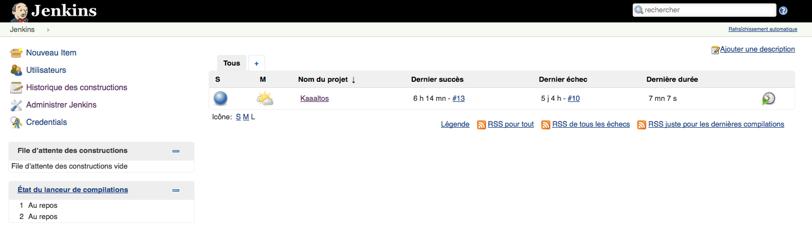
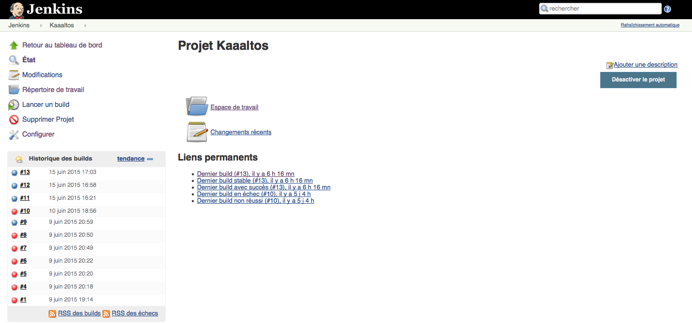
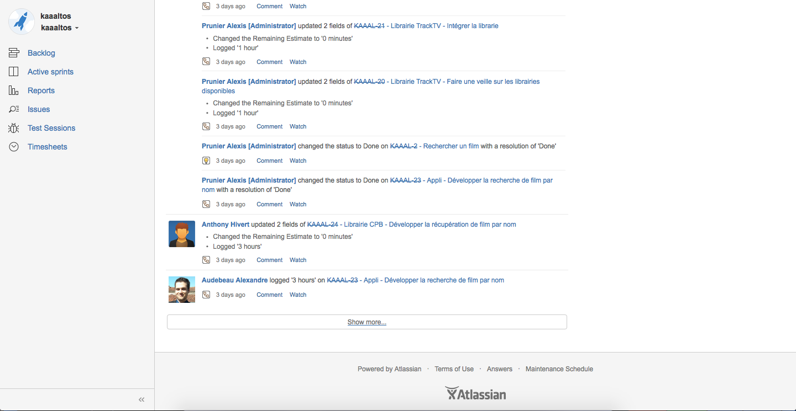

# Kaaaltos 
- Anthony Hivert
- Alexis Prunier (Scrummaster)
- Alexandre Audebeau

# Environnement

### Jenkins
###### Page d'accueil


###### Page du projet


### Bitbucket


### Jira
###### Historique

###### Diagramme


# Detail du projet

Créer une application permettant de streamer les fichier torrent du site cpasbine.pw afin d'obtenir une verison française de "PopcornTime".

# Gestion des dépendances
Les dépendances sont gérées via le fichier package.json.

```
"dependencies": {
        "cheerio": "0.19.0",
        "font-awesome": "4.3.0",
        "jquery": "2.1.4",
        "request": "2.57.0",
        "torrent-stream": "0.19.2",
        "karma": "0.12.36",
        "trakt-api": "0.2.0",
        "karma-chrome-launcher": "0.1.12",
        "karma-firefox-launcher": "0.1.6",
        "karma-jasmine": "0.3.5",
        "jasmine-node": "1.14.5",
        "read-file": "0.1.2",
        "nock": "2.5.0"
    }
```

Il faut ensuite taper la commande à la racine du projet 
```
npm install

```

# BUILD

Le build permet de construire l'applcation pour l'ensemble des OS principaux (Linux, Windows, MacOS)

```
#!bash

apt-get install npm nodejs
```
To avoid "/usr/bin/env: node: No such file or directory" error, create sym link


```
#!bash

ln -s /usr/bin/nodejs /usr/bin/node
```

## In jenkins
Set a bash line (nwbuild /path/to/my/project)

# Launch Tests

```
#!bash

jasmine-node /var/lib/jenkins/jobs/Kaaaltos/workspace/tests
```


