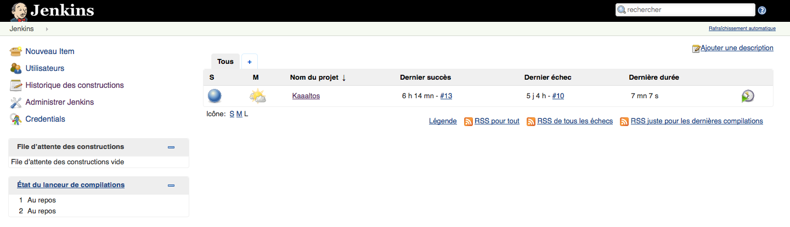
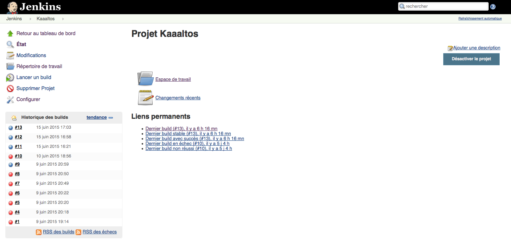
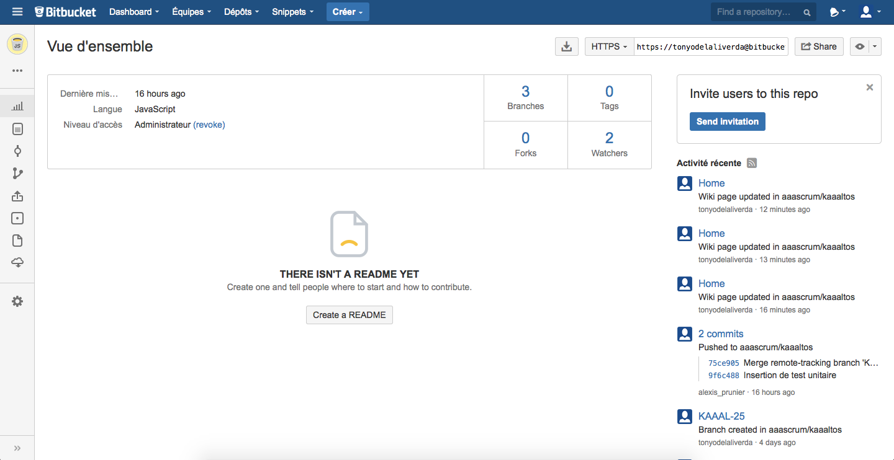
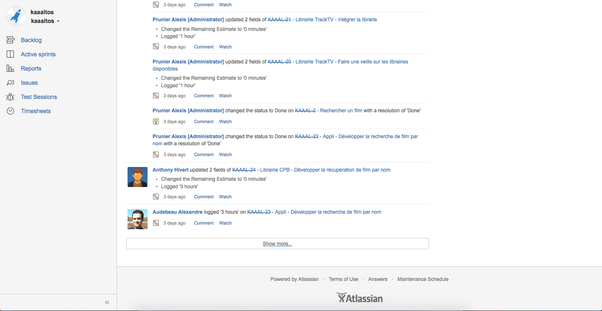
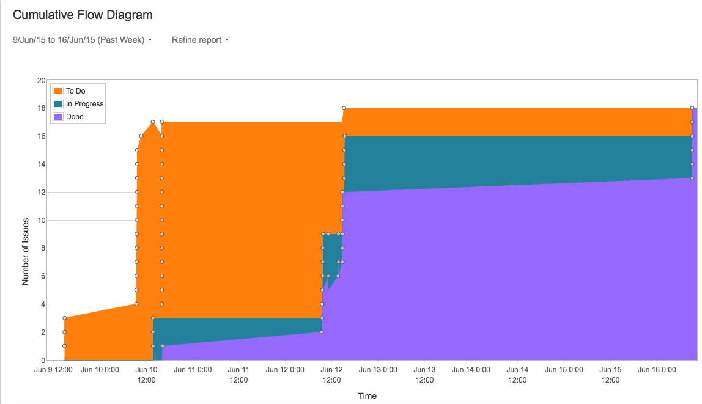
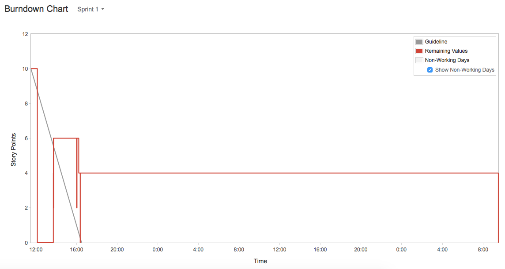

# Kaaaltos 
- Anthony Hivert
- Alexis Prunier (Scrummaster)
- Alexandre Audebeau

# Detail du projet
Créer une application permettant de streamer les fichiers torrents du site cpasbien.pw afin d'obtenir une verison française de "PopcornTime".

# Environnement

### Jenkins
###### Page d'accueil


###### Page du projet


### Bitbucket


### Jira
###### Historique

###### Diagramme




# Retour d'expérience de la méthodologie SCRUM

Nous avons utilisé un outil différent de la plupart des groupes qui est Jira Agile. C'est un outil de gestion de projet adapté à la méthodologie SCRUM. Nous avons donc eu recours à un total de 4 sprints dont un sprint dit "Zéro" qui comportait les tâches de mise en place de l'environnement de développement.

La première étape de la méthodologie était donc de définir les User Stories. Nous avons donc recencé les suivantes:
- Consulter les films disponibles par nom
- Consulter les films disponibles avec affichage de jaquette
- Affichage des détails d'un film
- Recherche de film par titre
- Visionner un film

Une fois que nous avions défini les fonctionnalités à développer durant ce module, nous avons découpé l'ensemble des User Stories en tâches.

Il est vrai que sur le Sprint 1 (le sprint où nous devions avoir un premier livrable), nous avions mal jugé la vélocité des différentes tâches. Cela était probablement du au choix de la technologie qui était quelque chose que nous ne maîtrisons pas. Cependant, il était simple de d'adapter au fur et à mesure de l'apprentissage de la technologie et de l'avancement du projet.

L'agilité que nous pouvons adopter lors de la définition du backlog et de celle des sprint backlogs est très intéressante. Nous avons une rapide vu sur les objectifs et les limites de la demi-journée suivante. Cela représente probablement une certaine sérénité quant à la réalisation des tâches attribuées. Nous ne sommes pas ou peu troubler par les éléments externes du sprint courant.

Globalement, le projet a été intéressant et enrichissant. Il est dommage de ne pas pouvoir avoir recours aux daily meeting qui restent un élément règlementé et indispensable à la bonne pratique de SCRUM.

# Gestion des dépendances
Les dépendances sont gérées via le fichier package.json.

```
"dependencies": {
        "cheerio": "0.19.0",
        "font-awesome": "4.3.0",
        "jquery": "2.1.4",
        "request": "2.57.0",
        "torrent-stream": "0.19.2",
        "karma": "0.12.36",
        "trakt-api": "0.2.0",
        "karma-chrome-launcher": "0.1.12",
        "karma-firefox-launcher": "0.1.6",
        "karma-jasmine": "0.3.5",
        "jasmine-node": "1.14.5",
        "read-file": "0.1.2",
        "nock": "2.5.0"
    }
```

Il faut ensuite taper la commande à la racine du projet 
```
npm install

```

# BUILD

Le build permet de construire l'applcation pour l'ensemble des OS principaux (Linux, Windows, MacOS)

```
#!bash

apt-get install npm nodejs
```
To avoid "/usr/bin/env: node: No such file or directory" error, create sym link


```
#!bash

ln -s /usr/bin/nodejs /usr/bin/node
```

## In jenkins
Set a bash line (nwbuild /path/to/my/project)

# Launch Tests

```
#!bash

jasmine-node /var/lib/jenkins/jobs/Kaaaltos/workspace/tests
```


